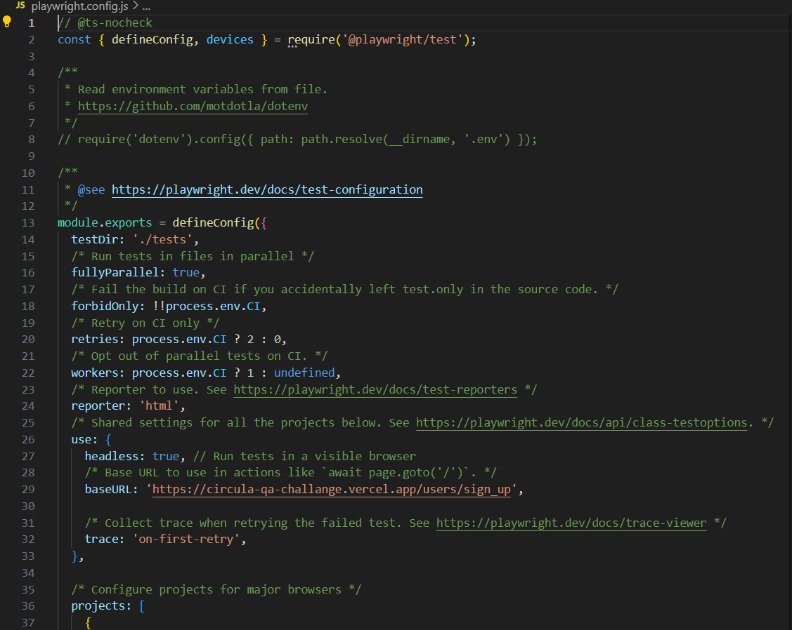
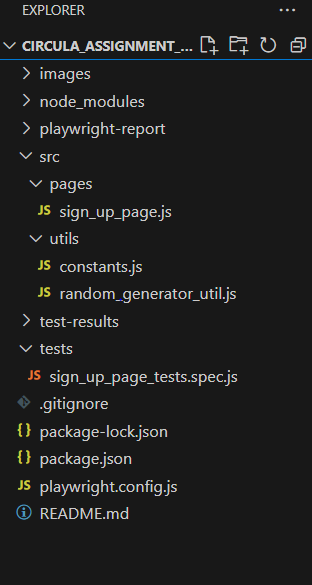
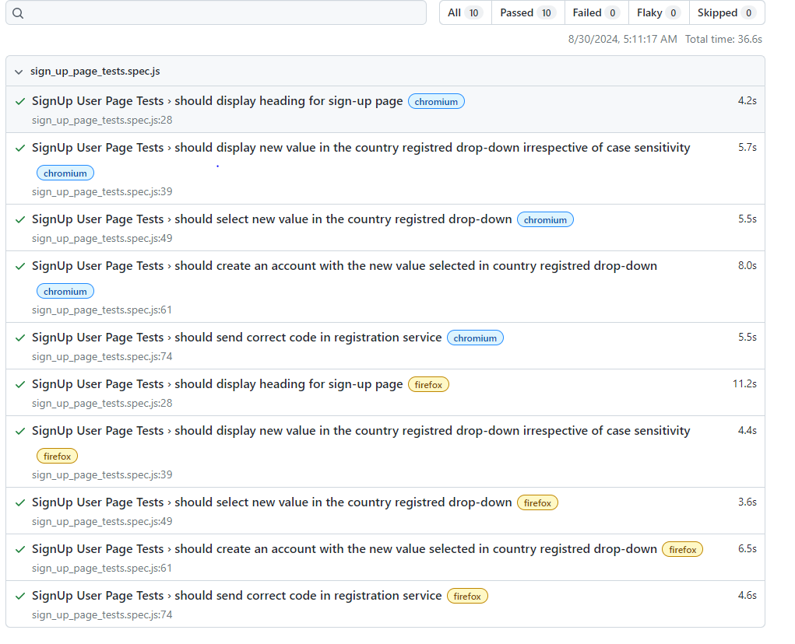

# Circula Assignment Task1

This project is a Playwright-based testing suite for [Circula/WebApp]. Playwright is a Node.js library for browser automation that provides a reliable and efficient way to test web applications across different browsers.

## Table of Contents
- [Features](#features)
- [Installation](#installation)
- [Configuration](#configuration)
- [Techology Stack](#techstack)
- [Design Pattern](#designpattern)
- [Naming Conventions](#namingconventions)
- [Test Execution](#testexecution)
- [Test Results](#testresults)

## Features
- **Cross-browser Testing**: Supports Chromium, Firefox

- **Test Automation**: Automate test for Sign-Up Page.

- **Hooks**: To implement tear up and down logic a hooks is created in the sign_up_page_test.js class.

- **Utils**: Random password and email generator utility has been created.

- **API Interception**: To see that correct data is being sent in the API request for country such that 'SE', I have intercepted the required API request to see the payload.


## Installation
```bash
# Install NodeJs and npm
 Windows : https://nodejs.org/en 
 macOS: https://nodejs.org/en/download/package-manager

# Navigate to the project directory
cd Circula_Assignment_Task1

# Install dependencies
npm install
```
## Configuration
The Playwright configuration file (playwright.config.js) is located in the root directory. Customize it according to your needs. For example, you can configure test execution mode, browsers, set base URL.




## Tech Stack
This project uses the following technologies and tools:

### 1. **Playwright**
- **Description**: A Node.js library for browser automation [Playwirght Documentation](https://playwright.dev/docs/intro)
- **Usage**: Allows end-to-end testing by interacting with browsers programmatically.

### 2. **Javascript**
- **Description**:   JavaScript is a high-level, versatile programming language primarily used for client-side scripting in web development. 
- **Usage**: 
In this project, JavaScript serves several key roles:
  - **Test Scripting**: JavaScript is used to write test scripts for automating interactions with the web application. This includes actions like clicking buttons, filling out forms, and verifying page content.
  - **Integration with Playwright**: Playwright, a Node.js library for browser automation, relies on JavaScript to define and execute tests. 
  - **Asynchronous Operations**: JavaScript's support for promises and async/await syntax allows for handling asynchronous operations in a clean and manageable way. This is crucial for interacting with web elements that might load or change dynamically.
  
  ## Design Pattern
  For organizing and maintaining code, making it more readable, reusable, and easier to manag the Page Object Model (POM) a design pattern is used in this project.This design creates a layer of abstraction between the test scripts and the application’s user interface. For further details, please refer to the [Playwirght Documentation for POM](https://playwright.dev/docs/pom)
  Here in this screenshot, you can see that sign-up page objects and functions class is created in pages folder and the relevant test of this class are added in the test folder.

     
 ## Naming Conventions
#### Lower Camel Case:
Used for variables, functions
#### Upper Camel Case : 
Used for Classes
#### Snake Case:
Used for project files

 ## Test Execution
```bash
# Navigate to the project directory
cd Circula_Assignment_Task1

# to execute the test in headless mode
In the playwright.config.ts file check browser property  headless: true,

# to execute the test in UI mode
In the playwright.config.ts file check browser property  headless: false,

# execute command
npx playwright test
```
 ## Test Results
 Test results are shown in a default html report that is configured in the playwright.config.ts file
 ```bash
# to view the result report
 npx playwright show-report
```

